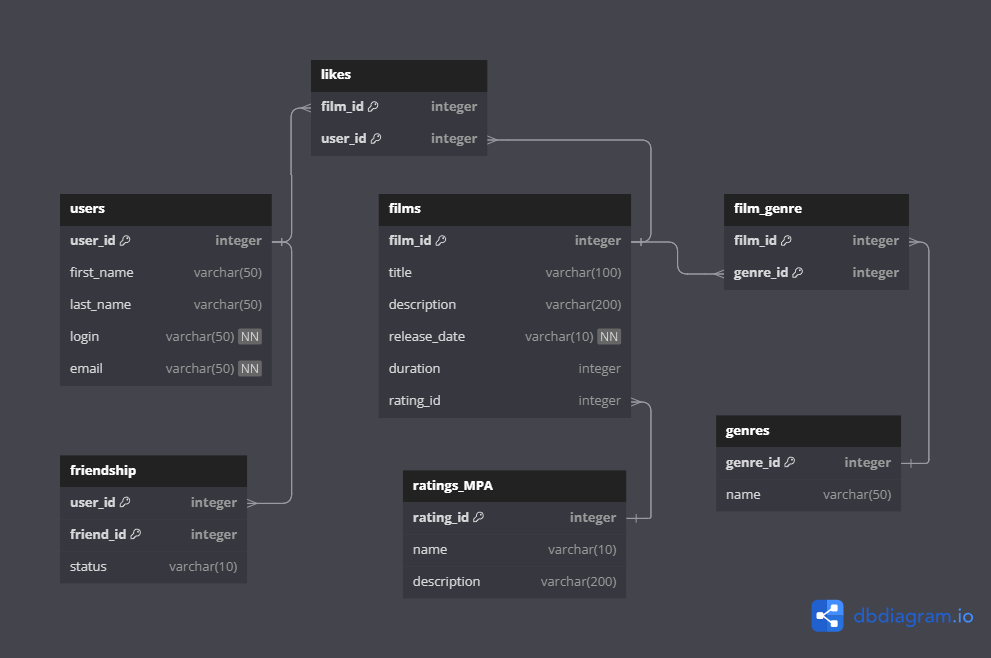

# java-filmorate

Примеры запросов для PostgreSQL:
	1. Получение списка всех пользователей:

	SELECT * 
	FROM users;

	2. Получение списка фильмов с рейтингом 'PG-13':
	
	SELECT f.*
	FROM films f
	JOIN ratings_MPA r ON f.rating_id = r.rating_id
	WHERE r.name = 'PG-13';

	3. Получение количества лайков фильма с id = 2:

	SELECT COUNT(*) AS like_count
	FROM likes
	WHERE film_id = 2;

	4. Получение списка друзей юзера с id = 3, статус дружбы с которыми подтвержден ('accepted'):

	SELECT u.*
	FROM users u
	JOIN friendship f ON u.user_id = f.friend_id
	WHERE f.user_id = 3 AND f.status = 'accepted';

